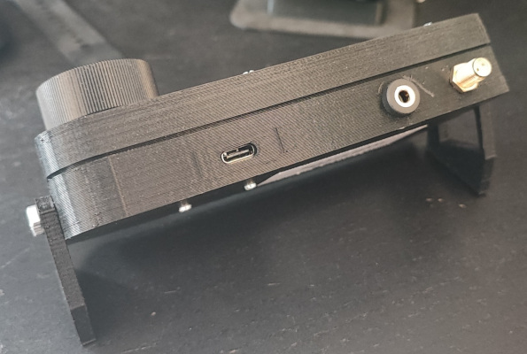

# SI4732 Radio

SI4732 Radio is a custom firmware project designed to power my home-built radio receiver.

Based on [G8PTN's ATS_MINI](https://github.com/G8PTN/ATS_MINI).

## Overview

It harnesses the capabilities of the SI4732 module to deliver high-quality FM radio performance, while the innovative design optimizes simple hardware into a complete and versatile receiver platform.

## Build

### [Schematics](https://oshwlab.com/joaquimorg/si4732-radio)

### [3D Case](https://www.tinkercad.com/things/8lZGNjQrsIt-si4732-radio?sharecode=HUZ-hwZfG91KAuRBbbe97_qAXLUEwu6S0yEopXSdGyc)

### [LS027B7DH01 Breakout board](https://github.com/ddB0515/LS027B7DH01-Breakout-board)

## Hardware Components

- **ESP32-S2 Mini**
- **SI4732 Module**
- **360-Degree Rotary Encoder Module**
- **Sharp LS027B7DH01 LCD:** A 2.7" display with 400x240 resolution.

## Project Inspiration and Credits

This project draws inspiration from several key contributions in the community:

- [G8PTN's ATS_MINI](https://github.com/G8PTN/ATS_MINI)
- [Ralph Xavier](https://github.com/ralphxavier/SI4735)
- [PU2CLR, Ricardo](https://github.com/pu2clr/SI4735)
- [Goshante](https://github.com/goshante/ats20_ats_ex)

Special thanks to G8PTN for the original ATS_MINI firmware, which served as the cornerstone for this adaptation.

## License

This project is released under the [MIT License](https://github.com/joaquimorg). The full license text is provided below:

    MIT License

    Copyright 2025 joaquim.org

    Permission is hereby granted, free of charge, to any person obtaining a copy
    of this software and associated documentation files (the "Software"), to deal
    in the Software without restriction, including without limitation the rights
    to use, copy, modify, merge, publish, distribute, sublicense, and/or sell
    copies of the Software, and to permit persons to whom the Software is
    furnished to do so, subject to the following conditions:

    The above copyright notice and this permission notice shall be included in all
    copies or substantial portions of the Software.

    THE SOFTWARE IS PROVIDED "AS IS", WITHOUT WARRANTY OF ANY KIND, EXPRESS OR
    IMPLIED, INCLUDING BUT NOT LIMITED TO THE WARRANTIES OF MERCHANTABILITY,
    FITNESS FOR A PARTICULAR PURPOSE AND NONINFRINGEMENT. IN NO EVENT SHALL THE
    AUTHORS OR COPYRIGHT HOLDERS BE LIABLE FOR ANY CLAIM, DAMAGES OR OTHER
    LIABILITY, WHETHER IN AN ACTION OF CONTRACT, TORT OR OTHERWISE, ARISING FROM,
    OUT OF OR IN CONNECTION WITH THE SOFTWARE OR THE USE OR OTHER DEALINGS IN THE
    SOFTWARE.